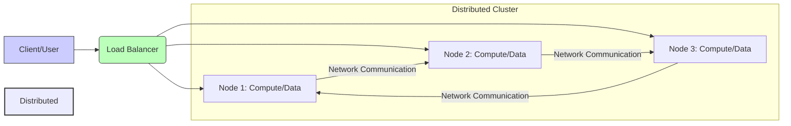

## 🎯 Definition: What is a Distributed System?

A **distributed system** is a collection of **independent computers (nodes)** that, to the users, appear and function as a **single coherent system**.

Each node:
* Runs its own processes.
* Stores a part of the overall data.
* Communicates with other nodes over a network to achieve a common, unified goal.

### 💡 The Key Idea

Instead of relying on one powerful, monolithic machine to handle all tasks, work is intelligently **divided** and **coordinated** among multiple interconnected machines. This design choice is fundamental to achieving modern requirements for **scalability**, **reliability**, and **fault tolerance**.

---

## 🌎 Intuitive Examples

The "magic" of distributed architecture is its seamless nature. To the end user, it feels like one unified system:

| Service | Real-World Distribution | The Goal |
| :--- | :--- | :--- |
| **Google Search** | Your query is **not** processed by one computer; it's distributed across **thousands of servers** globally. | **Performance** and **Speed** |
| **Netflix Streaming** | Movie data is served from multiple **CDN (Content Delivery Network) servers** geographically near your location. | **Availability** and **Low Latency** |
| **Amazon/Cloud** | The service remains active even when an entire data center region fails. | **Fault Tolerance** |

---

## 🏛️ Main Goals of Distributed Systems

These five pillars define the successful operation and necessity of a distributed architecture:

### 1. Scalability 📈
The ability to easily handle a growing workload (users, transactions, or data) by simply **adding more machines** (nodes) without service interruption.

* *Example:* Adding more web servers to a load-balanced pool as the user base increases.

### 2. Fault Tolerance (Reliability) 🛡️
The system **keeps running** and functioning correctly even if some of the individual nodes or network links fail.

* *Example:* One microservice crashes, but its traffic is automatically rerouted to a healthy replica, ensuring zero downtime for the user.

### 3. Performance & Throughput ⚡
Tasks can be executed **in parallel** across multiple nodes, dramatically improving overall speed, responsiveness, and the volume of work processed per unit of time.

* *Example:* Running parallel search indexing across an entire cluster.

### 4. Availability (Uptime) ✅
The service is accessible to users whenever they need it, maximized by redundancy and the ability to route around failures.

### 5. Transparency 👤
The core principle that **users shouldn't know (or care)** that multiple machines are working behind the scenes. The complexity of distribution is completely hidden.

---

## 🌐 Architectural Overview (Visualized)

The following simple diagram illustrates the basic concept of separating client interaction from internal distributed processing.

## ⚖️ CAP Theorem: Consistency, Availability, Partition Tolerance

### Definition
CAP Theorem states that a distributed system can provide only two of the following three guarantees at the same time:

1.  **C**onsistency
2.  **A**vailability
3.  **P**artition Tolerance

It’s impossible to achieve all three simultaneously when a **network partition** occurs.

---

### 1. Consistency (C)

| Aspect | Description |
| :--- | :--- |
| **Meaning** | Every read receives the **most recent write** or an error. In other words, all nodes in the system reflect the **same data** at the same time. |
| **Example** | When you check your bank account from any location, you should always see the exact same balance. If you withdraw ₹1000 from one ATM, the updated balance should be instantly visible on the app or another ATM. |
| **Trade-off** | To achieve this, the system might reject requests (**sacrificing availability**) until data synchronization completes. |

---

### 2. Availability (A)

| Aspect | Description |
| :--- | :--- |
| **Meaning** | Every request gets a **response** — the system remains operational even if some nodes fail. The response might not contain the latest data, but the system doesn’t hang or error out. |
| **Example** | On Instagram, you might see 10 likes while your friend sees 12. That’s acceptable because user experience matters more than strict accuracy. Instagram prefers availability over strong consistency — you always get some response, even if slightly outdated. |
| **Trade-off** | System may return **stale data** if nodes are out of sync. |

---

### 3. Partition Tolerance (P)

| Aspect | Description |
| :--- | :--- |
| **Meaning** | The system continues to operate even when communication between nodes fails (i.e., when there’s a **network partition**). |
| **Example** | If a data center in Mumbai can’t communicate with another in New York due to a network glitch, both should still **continue serving users** instead of crashing. |

**Key Point:** In a distributed system, network partitions are inevitable (servers can fail, networks can lag, packets can drop). Hence, **Partition Tolerance (P) cannot be sacrificed** in real-world systems.

---

### ➡️ The Real-World Decision

Therefore: In practice, every real distributed system must choose between **Consistency** and **Availability** when a partition occurs.

You must pick:

#### 1. CP System (Consistency + Partition Tolerance)

* **Prioritize:** Correct, up-to-date data over uptime.
* **Examples:** PostgreSQL, MongoDB (in some configs), HBase.
* **Used in:** Banking, financial transactions, inventory systems.

#### 2. AP System (Availability + Partition Tolerance)

* **Prioritize:** Uptime and user experience over strict accuracy.
* **Examples:** Cassandra, DynamoDB, CouchDB.
* **Used in:** Social media, e-commerce, streaming services.

> *(CA systems — Consistency + Availability — only exist theoretically or in single-node systems where partitions don’t happen.)*

---

### Challenges

* **Trade-offs are application-specific** – You must decide what matters more: correctness or uptime.
* **Design complexity** – Achieving partial consistency or eventual consistency adds engineering overhead.
* **Performance cost** – Synchronization and replication delay impact latency.

---

### Conclusion

CAP Theorem is a guiding principle for designing distributed systems. It reminds us that:

> **“When a network partition occurs, you must choose between Consistency and Availability.”**

This helps architects make informed trade-offs depending on the system’s needs — accuracy vs. uptime.
